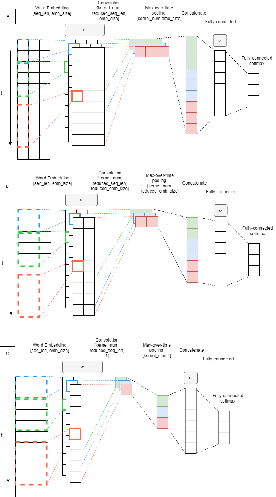

# KIV / ANLP Exercise 03

*Deadline to push results:* 2024-11-10 (San) 23:59:59

*Maximum points:* 

The Goal
========

Implement missing parts in the given template of the supervised machine
learning stack for predicting sentiment of given sequence (Sentiment Classification Task). 
Train and evaluate the system on the given data set. Use architectures described in the
following section.

What is Semantic Sentiment Analysis 
===================================
Varies by domain (most common: 2-3 classification) It is not a dogma...

CSFD Sentiment Czech Dataset (user ranking 0-100%): positive,neutral,negative

Project Structure 
=================

- [tests]  
- [data]
    -   *csfd-train.tsv*
    -   *csfd-test.tsv*
- *main03.py*

The Data Set
============

- Your dataset is split : train/test
- Your dataset has labels in tsv 
  - negative:0 
  - neutral:1 
  - positive:2

Tasks \[20+5 points in total\]
===============================

1. **Analyze the Dataset**

**CF\#STATISTICS**

- You can use scripts from Exercise 02 as a starting point.
- Count occurrences of words in the data set, and prepare a list of
top\_n words
- Count statistics about coverage of tokens in training dataset 
- Coverage is ratio between tokens you have in your vocabulary and all tokens.
Do not count pad tokens
- Count statistics about class distribution in dataset (train/test)

 `Answer begin`

The dataset looks balanced.

For this task, I have also created histograms of sequence lengths, for later use in the config (`config["seq_len"]`).

    Mean training sequence length: 50.554254517156686
    Std dev training sequence length: 51.75246448261309
    Mean testing sequence length: 50.75292701608491
    Std dev testing sequence length: 52.29935225534991
    Q3 training sequence length: 66.0
    Q3 testing sequence length: 66.0
    90-percentile training sequence length: 112.0
    90-percentile testing sequence length: 114.0

| Seq Len Statistics | Train         | Test          |
|--------------------|---------------|---------------|
| Mean ± Std Dev     | 50.55 ± 51.75 | 50.75 ± 52.30 |
| Q3; 75 %           | 66.00         | 66.00         |
| 90-percentile      | 112.00        | 114.00        |

For the reason of the high standard deviation, I have decided to use the mean + std dev as the sequence length -- approximately 100.
Which is somewhere between the 75 % quantile and the 90-percentile, which seems as reasonable sequence length to me.
Extremely long sequences are not that common (100+ words), so we are not loosing that much information and shorter sentences will get noised with padding.

 `Answer end`

2. **Prepare Word Embeddings**.
    https://drive.google.com/file/d/1MTDoyoGRhvLf15yL4NeEbpYLbcBlDZ3c/view?usp=sharing

[//]: # (# https://fasttext.cc/docs/en/crawl-vectors.html)
[//]: # (# EMB_FILE = "b:/embeddings/Czech &#40;Web, 2012, 5b tokens &#41;/cztenten12_8-lema-lowercased.vec")
Use the *list of top N word*s for pruning the given Word embeddings.

!! - - IMPORTANT - - !!

**Force vocab size (N most frequent words from the train dataset)
Words without embedding in the given emb file initialize randomly**

 `Answer begin`

Unit tests in `cv02` literally wanted us to not force vocab size and to prune / not add, if the word is unknown.

Tests now want us to force vocab size and initialize randomly -- for this reason I have changed your tests imports and re-implemented the function `load_ebs`, because I want my tests from `cv02` to pass.

All I have changed in the `test.py` is `from cv02.main02 import load_ebs` -&gt; `from cv03.main03 import load_ebs`.

Please  don't kill me for changing `test.py`; I have not changed anything else.

 `Answer end`

The cache will be stored on the hard drive for future use.
You should see two new files *word2idx.pckl* and *vecs.pckl*

3. **Prepare Dataset for Training**
 
Use load_dataset from datasets to load csv dataset.

    from datasets import load_dataset

    cls_dataset = load_dataset("csv", delimiter='\t', data_files={"train": [CSFD_DATASET_TRAIN],
                                                                "test": [CSFD_DATASET_TEST]})
4. **Implement training loop**
   1. Implement basic training loop. 
   2. Implement testing for model and dataset
   

5. **Implement Embedding Averaging Model - Our Baseline** 

Implement model which uses average of sequence embeddings to represent the sequence.

The Model takes sequence of numbers as an input [SEQ_LEN]. Use prepared word embeddings (task-2) to lookup word
vectors from ids [SEQ_LEN,EMB_SIZE]. Freeze embeddings. Add one trainable projection layer on top of the
embedding layer [SEQ_LEN,EMB_PROJ]. Use the mean of all words vectors in a sequence as
a representation of the sequence [EMB_PROJ].

Add classification head [NUM_OF_CLASSES].

Primitives to use:
- nn.Embedding 
- nn.Softmax
- nn.Linear
- nn.Dropout
- nn.[activation]

**[5pt]**

6. **Implement CNN Model**

For implementing architecture of the model use configuration in form of list, 
where each item correspond to a setup of one layer of the model (prepared in **CF\#CNN_CONF**).  

Primitives to use:
- nn.Embedding
- nn.Conv1d, nn.Conv2d
- nn.MaxPool1d, nn.MaxPool2d
- nn.Dropout
- nn.Linear

7. **Log these:**

    MANDATORY_HP = ["activation", "model", "random_emb", "emb_training", "emb_projection", "lr", "proj_size", "batch_size"]
    MANDATORY_HP_CNN = ["cnn_architecture", "n_kernel", "hidden_size"]
    MANDATORY_M = ["train_acc", "test_loss", "train_loss"] 

8. **Run Experiments with different Hyper-parameters** 

9. **[5pt]** **The best performing experiment run at least 10 times** 
    To these runs add special tag : `best`

10. **[5pt]** **Tune More Voluntarily**

You can use any technique in scope of CNN architecture. 
Best performing CNN gets 5 extra points. 
If confidence intervals of more students overlay, each student gets extra points.

# My results **[5pt]** 
## Hyper Parameter Analysis
### Parallel Coordinate Chart

 `Answer begin`

_MISSING_

 `Answer end`

## Confusion matrix -- best run ##

 `Answer begin`

__MISSING__

 `Answer end`

### Discussion

Which hyperparameters did I tune?

Which had the greatest influence?

Have I used other techniques to stabilize the training, and did I get better results?

 `Answer begin`

_MISSING_

 `Answer end`

# To Think About:

## Practical Question

1.  Compare both similarity measures (Fully-connected, cosine):

    -   speed of convergence,

    -   behaviour in first epochs,

    -   accuracy.

2.  Does the size of the effective vocabulary affect the results? How?

3.  Have you sped up debugging the system somehow?

4.  Can we save some processing time in the final test (10 runs) without
    affecting the results?

5.  What is the role of UNK and PAD token in both models?

6.  Can you name some hints for improvement of our models?

7.  Can we count UNK and PAD into sentence representation average
    embedding? Does it affect the model?

8.  What is the problem with output scale with the neural network?

9.  What is the problem with output scale with cosine?

10. What is the best vocab size? Why? Task8

11. What is the best learning rate? Why?

12. Which hyper-parameters affect memory usage the most?

## Theoretical Questions

1.  Is it better to train embeddings or not? Why?

2.  Is it important to randomly shuffle the train data, test data? Why?
    When?

3.  What is the reason for comparing MSE on train dataset or testing
    dataset with Mean of training data or mean of testing data?

4.  Can you name similar baselines for other tasks (Sentiment
    classification, NER, Question Answering)?
